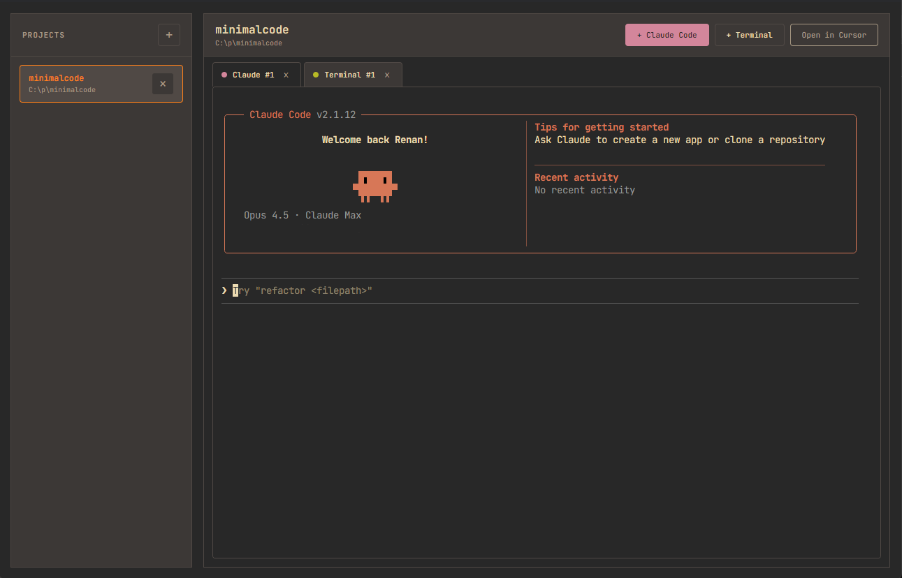

# minimalcode

A minimal workspace manager for Claude Code and terminal sessions.

No worktrees. No kanban UI. No PR creation. No git diff viewers. No spec/card management.

Just a simple UI to:
- Manage project folders
- Launch Claude Code sessions
- Launch terminal sessions
- Switch between them

That's it.

## Screenshot



## Stack

- Electron
- React + TypeScript
- xterm.js + node-pty (embedded terminals)
- Vite
- Gruvbox theme

## Run

```bash
npm install
npm run dev
```

## Build

```bash
npm run build
```

## Why

Sometimes you just want to open a project, run Claude Code, and have a terminal nearby. Without the cognitive overhead of a full IDE or the friction of managing multiple terminal windows.